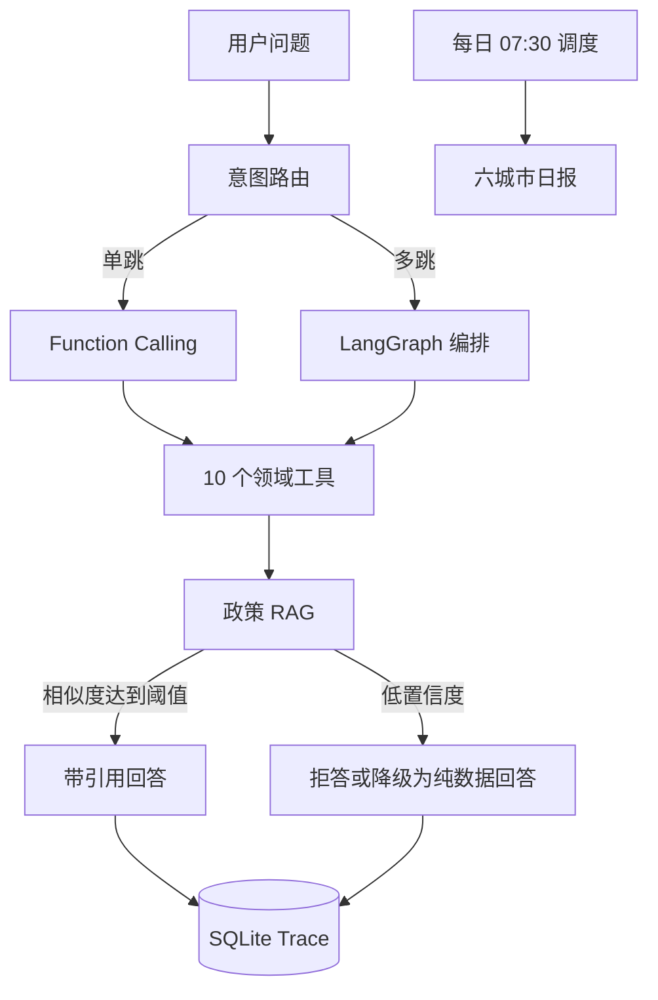

# 项目案例研究：多城市空气质量 AI Agent

## 一、业务问题

空气质量数据本身并不难查询，难点在于用户的问题并不会严格对应某一个 API。例如：

- “北京现在空气质量怎么样”需要实时数据工具。
- “未来 24 小时会不会超标”需要预测与阈值判断。
- “北京和上海哪个更适合晨跑”需要城市对比和实时数据。
- “PM2.5 的国家标准限值是多少”必须查政策条款，不能由语言模型直接生成。
- “把高污染时段列出来并解释原因”可能同时需要多个工具和引用依据。

因此，项目目标不是做一个“会聊天的天气接口”，而是实现一个具备工具选择、引用溯源和拒答边界的领域 Agent。

## 二、系统架构



系统支持两种运行模式：

| 模式 | 条件 | 作用 |
|---|---|---|
| LLM Agent | 配置 `LLM_API_KEY` | LangGraph + OpenAI 兼容接口，演示大模型编排 |
| Rule Agent | 未配置 API Key | 正则与规则引擎自动降级，保证演示环境可运行 |

## 三、工具与数据底座

数据底座包含 6 个城市、1 年的小时级记录，共 52,704 条 CAMS 再分析数据。工具注册表包含 10 个能力：

- 城市概览、实时数据、未来 24 小时预测。
- 多城市对比、季节分析、污染物相关性。
- 当前告警、综合预警、模型训练、政策条款检索。

工具选择采用 Function Calling Schema 统一描述，规则版与 LLM 版共享同一套工具，避免两套业务逻辑。实时数据未配置 WAQI Token 时自动回退到历史数据；政策检索使用轻量归一化打分，并设置相似度阈值。

## 四、评测方法与真实结果

评测对象是规则版 Agent 的工具选择逻辑，数据集包含 60 条问题，覆盖 10 个工具、6 个城市、污染物中英文缩写、5 条多跳问题和 12 条易混淆边界样本。

判定标准是实际工具集合与期望工具集合完全相等，少一个、多一个或多个无关工具都算错误。

| 迭代 | 完全正确 | 准确率 |
|---|---:|---:|
| 第一轮 | 48 / 60 | 80.0% |
| 第二轮 | 59 / 60 | 98.3% |
| 第三轮 | 60 / 60 | 100.0% |

第一轮的错误集中在三类问题：细粒度告警被综合预警抢先匹配、模型训练没有专属意图、政策问题误路由至数据概览。修复后将原 12 条 bad case 留在回归集，防止后续回退。

> 需要注意：100% 是规则版工具选择在 60 条回归集上的结果，不代表 LLM 全链路回答准确率。这个边界在 `backend/evaluation/results.md` 中有完整说明。

## 五、关键工程决策

### 1. 无 API Key 也能运行

LLM 接口不可用或未配置时，系统自动切换到规则版 Agent。这样既能让招聘方直接运行演示，也避免把外部 API 作为唯一成功条件。

### 2. 引用与拒答优先于“强行回答”

政策问题先检索知识库，低置信度时拒答或回退为纯数据回答。回答中要求出现条款编号和数据来源，降低政策条款被模型编造的风险。

### 3. Trace 作为评测闭环

每次问答都会写入 SQLite，记录 prompt、响应、延迟和工具调用。线上 bad case 可以进入评测集，再通过回归测试验证修复效果。

### 4. 规则版作为可验证基线

LLM 版引入的不确定性较高，规则版则提供确定、可重复的基线。两套模式共享工具注册表，便于比较意图路由和工具调用层的差异。

## 六、验证与运行

健康检查实测返回 `200`，应用包含 35 条路由，新增的 `tests/test_health.py` 会验证 `status=ok` 和 `agent=enabled`。预测模型不随仓库提交，首次预测会从空气质量数据自动训练并缓存。

```bash
pip install -r requirements.txt
uvicorn backend.main:app --reload
python backend/evaluation/eval_agent.py
```

## 七、当前边界

- `get_realtime` 依赖 WAQI Token；未配置时只能确认降级路径，不能验证真实实时链路。
- 政策知识库目前只有 11 条条款，适合演示 RAG 边界，不代表完整法规系统。
- 60 条回归集主要验证工具选择，不是通用自然语言理解基准。
- trace 使用 SQLite，适合单机演示；生产环境应替换为可查询、可保留策略明确的观测存储。
- LLM 版仍需要更多真实 bad case 和多轮对话评测。

## 八、面试讲解框架

### 为什么需要规则版降级？

演示环境无法保证用户一定配置外部模型 API，且外部服务可能出现限流或网络故障。规则版提供可确定复现的基线，LLM 不可用时仍能完成基本工具调用。

### 如何控制政策问答幻觉？

政策问题不能把相似度最高的文本直接交给模型自由生成，而是先检索条款、保留相似度分数，再要求回答带条款编号；低置信度时拒答或仅返回数据层结论。

### 60 条 100% 是否说明 Agent 很强？

不能这样表述。它说明在明确设计的回归集上，规则路由没有回退；真正需要继续验证的是 LLM 多轮对话、复杂组合工具和真实用户分布。

## 九、简历可复用表述

- 设计多城市空气质量领域 Agent，统一封装 10 个数据、预测、预警与政策检索工具，支持 LLM LangGraph 编排和无 API Key 的规则版自动降级。
- 构建政策 RAG 与引用溯源链路，在低置信度场景执行拒答或纯数据回退，降低政策条款幻觉风险。
- 建立 60 条工具选择回归集，将规则版准确率从 80.0% 迭代到 100.0%，并把首轮 12 条 bad case 固化为回归样本。
- 通过 SQLite trace 和结构化评测报告记录工具调用、延迟与结果，为后续 LLM few-shot 迭代提供数据闭环。

## 十、后续演进

1. 扩充政策知识库并加入条款级切分、重排和引用定位。
2. 增加真实多轮对话和复杂多跳任务评测。
3. 将 trace 指标接入可观测平台，区分模型错误、工具错误和检索错误。
4. 增加 WAQI 实时链路的可重复集成测试。