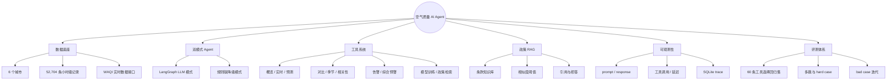
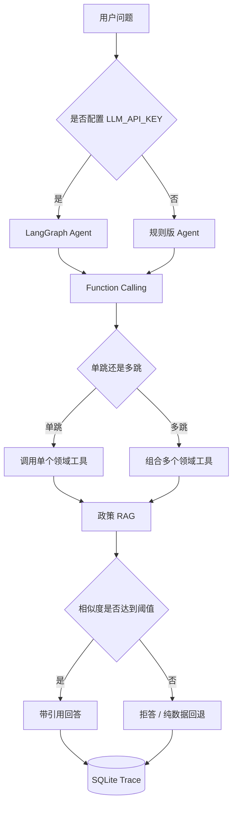
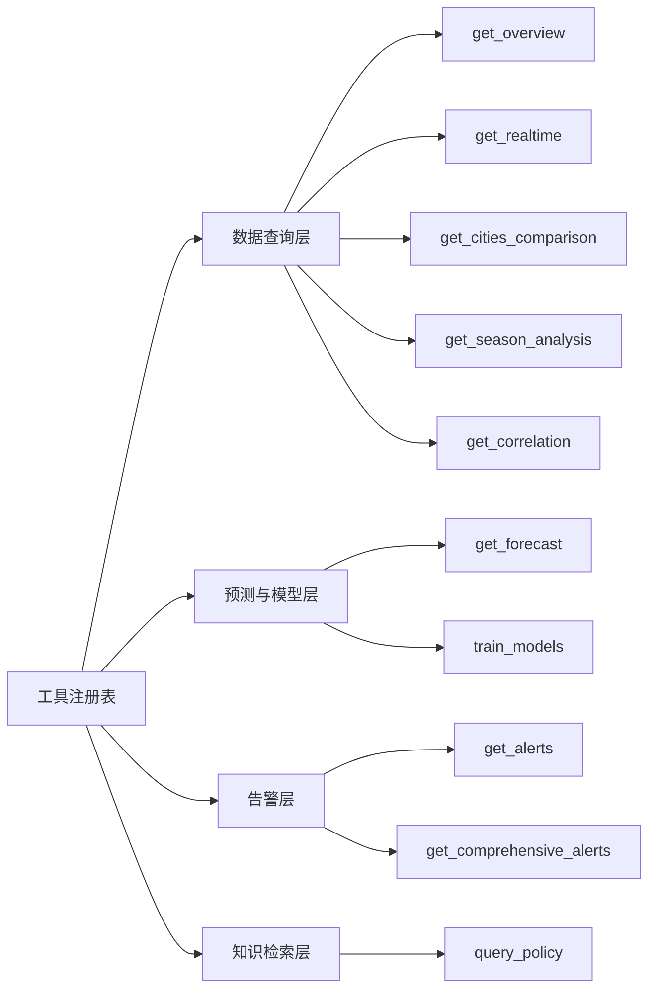
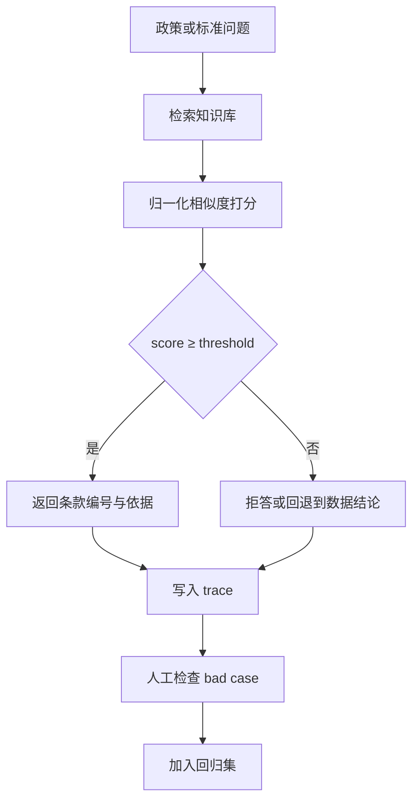
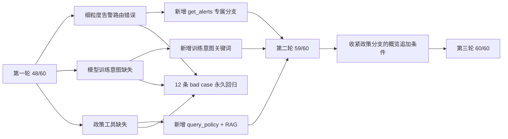

# 项目可视化与可解释性指南

本页用 Mermaid 展示空气质量 Agent 的问题路由、工具调用、RAG 拒答、trace 和评测闭环。图形全部来自当前仓库实现，不表示未完成的外部服务已经可用。

## 图 1：项目能力思维导图

## 图 2：意图路由与 Agent 执行流

## 图 3：10 个工具的领域分层

工具 Schema 在 `backend/tools/implementations.py` 中统一注册，LLM 版和规则版共享同一套调用入口。

## 图 4：政策 RAG 的可解释性决策树

这条决策树解释了为什么系统不直接把相似文本交给语言模型自由生成：政策问题必须先锁定依据，再允许生成解释。

## 图 5：评测迭代与错误归因

图中的 100% 只代表规则版工具选择在 60 条回归集上的结果，不代表 LLM 全链路准确率。

## 视觉阅读顺序

1. 图 1 看项目范围和数据底座。
2. 图 2 看 LLM 与规则版如何共享工具链。
3. 图 3 看 10 个工具的领域职责。
4. 图 4 看政策 RAG 为什么允许拒答。
5. 图 5 看 80% 到 100% 的真实迭代路径和归因。